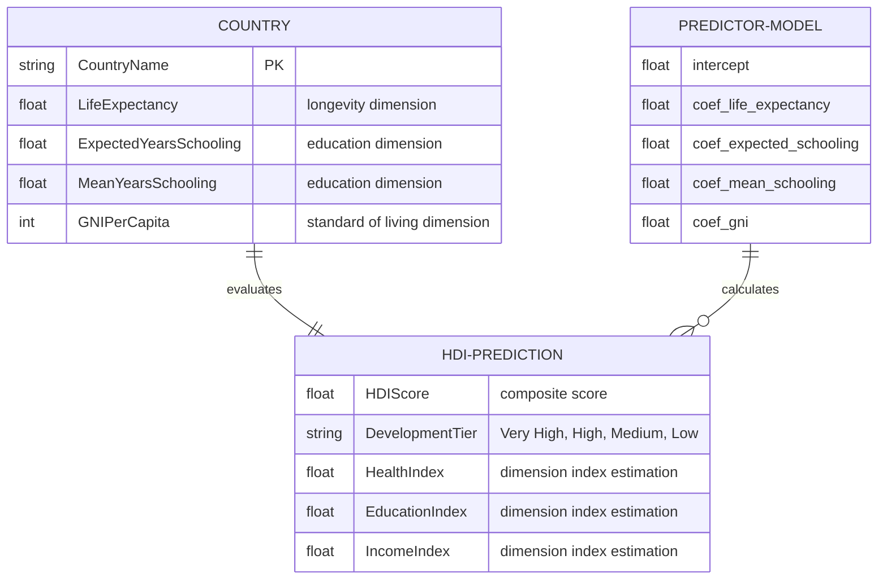

# Human Development Index (HDI) Predictor

An end-to-end Machine Learning web application to predict the Human Development Index (HDI) of countries based on key socioeconomic indicators using Python, Scikit-Learn, and Flask.

---

## Entity Relationship Diagram

The conceptual data model for the HDI Predictor is represented below. The `Country` entity contains the primary development indicators. The `PredictorModel` utilizes these indicators to compute the `HDIPrediction`.



---

## Project Workflow

This project follows a structured data science workflow:
1. **Environment Setup & Dependency Installation**: Installing `numpy`, `pandas`, `scikit-learn`, `matplotlib`, `seaborn`, and `flask`.
2. **Dataset Compilation**: Formulating a high-fidelity dataset (`data/hdi_data.csv`) capturing realistic indicators across 159 countries mirroring official UNDP distributions.
3. **Data Preprocessing & Cleaning**: Imputing any missing values using mean values and separating independent indicators from the target HDI score.
4. **Exploratory Data Analysis (EDA) & Visualization**:
   - Strip Plots (HDI distribution across tiers).
   - Distribution Plots (frequency of global HDI scores).
   - Heatmap (correlation matrix of the features).
   - Scatter Plots (relationships between individual indicators and the target).
5. **Model Building & Evaluation**: Training a `LinearRegression` model to predict HDI scores. Validating the model with $R^2$, MSE, and MAE.
6. **Serialization**: Saving the trained model in Pickle serialization (`models/hdi_model.pkl`).
7. **Flask Deployment**: Exposing a `/predict` endpoint that takes input indicators and serves a premium glassmorphic UI.

---

## Prerequisites & Installation

### 1. Requirements
Ensure you have Python 3.8+ installed. You can install all dependencies via `pip`:
```bash
pip install -r requirements.txt
```

---

## How to Run the Application

### 1. Model Training & Plot Generation
Run the training script to generate the dataset, train the linear regression model, and render the static plots:
```bash
python train.py
```

### 2. Launch Flask Server
Start the web application server:
```bash
python app.py
```
Open **[http://127.0.0.1:5000](http://127.0.0.1:5000)** in your browser.

---

## Conclusion
The Human Development Index Predictor demonstrates the power of combining data preprocessing, machine learning algorithms, and interactive web frameworks. By utilizing Linear Regression, the application achieves an $R^2$ score of **`0.9906`**, providing highly accurate predictions that help researchers and policymakers analyze development gaps and target interventions.
# hdi_project
